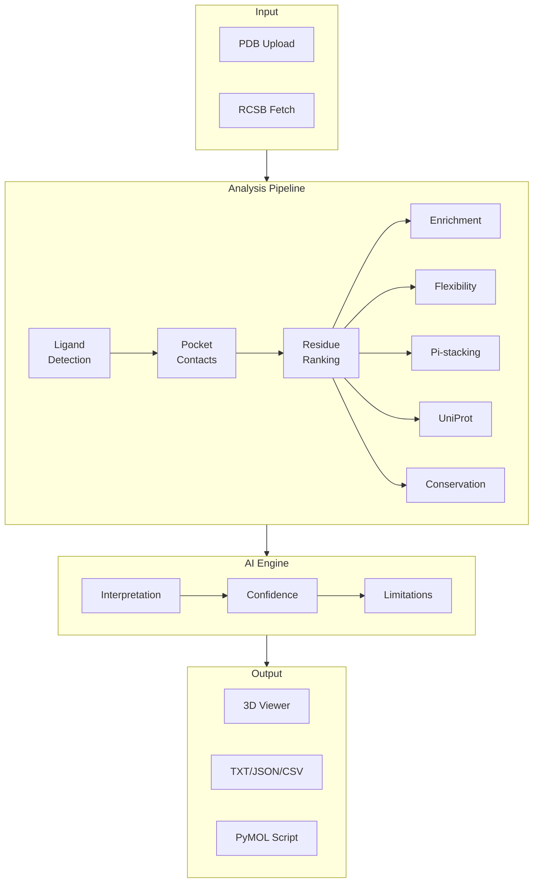

# Protein Structure Copilot

**AI-Powered Structural Biology Platform** — Ligand pocket analysis, mutation impact assessment, evolutionary conservation, and geometric interaction detection with real-time 3D visualization.

[](https://protein-structure-copilot.onrender.com)
[](https://python.org)
[](https://flask.palletsprojects.com)
[]()
[](LICENSE)

## Architecture



## Features

### Binding Site Characterization
- Automatic ligand detection from PDB HETATM records
- Pocket contact residue identification (5 A distance cutoff)
- Multi-criteria residue ranking (distance, interaction type, chemistry, enrichment)
- Interaction classification: hydrophobic, polar/H-bond, charged, van der Waals

### Advanced Structural Analysis
- **B-factor Flexibility** — Per-residue thermal displacement analysis. Classifies pocket residues as rigid, normal, flexible, or highly flexible relative to the whole-protein mean
- **Pi-stacking Detection** — Geometric identification of pi-pi (face-to-face, edge-to-face, T-shaped) and cation-pi interactions among aromatic pocket residues (PHE, TYR, TRP, HIS)
- **Statistical Enrichment** — Fisher exact test comparing pocket residue composition to whole-protein baseline
- **UniProt Integration** — REST API functional annotations: active sites, binding sites, domains, mutagenesis data, natural variants, and post-translational modifications

### Mutation Analysis
- Single point mutation scan with structural impact assessment
- WT vs Mutant comparison with lost/gained contact visualization
- Chain-specific residue indexing with insertion code handling

### AI-Powered Interpretation
- Structured multi-section interpretation: binding mode, key interactions, structural features, conservation, mutation implications, recommendations
- Confidence assessment with reasoning and evidence provenance
- Limitations and caveats with safety guardrails

### 3D Visualization
- 3Dmol.js interactive viewer with cartoon + stick + sphere rendering
- Interaction distance lines with type-specific coloring
- Hotspot focus, ligand focus, pocket surface toggle
- Refined color scheme with desaturated ribbon and reduced visual noise

### Export
- Report (TXT), Data (JSON), Data (CSV), AI Report, PyMOL script

## Tech Stack

| Layer | Technology |
|-------|-----------|
| Backend | Python 3.11+, Flask 3.0, Gunicorn |
| AI/LLM | DeepSeek / OpenAI API compatible |
| 3D Viewer | 3Dmol.js |
| Frontend | Vanilla JS (ES5+), CSS Custom Properties, JetBrains Mono + DM Sans |
| Data Sources | PDB format parser, UniProt REST API, ConSurf-DB |
| Testing | pytest (58 tests) |
| Deployment | Render |

## Quick Start

```bash
git clone https://github.com/wqbwshady-alt/protein-structure-copilot.git
cd protein-structure-copilot

# Optional: create virtual environment
python3 -m venv .venv && source .venv/bin/activate

pip install -r requirements.txt
python app.py
# Open http://127.0.0.1:5000
```

For AI interpretation, create a `.env` file with your API key:

```bash
DEEPSEEK_API_KEY=your_key_here
```

The app works without it — falls back to rule-based interpretation.

## Recommended Test Cases

| PDB ID | Ligand | Notes |
|--------|--------|-------|
| `1ATP` | `ATP` | PKA kinase, rich UniProt annotations, Domain + Binding site features |
| `1HSG` | `MK1` | HIV protease, classic drug target, aromatic-rich pocket |
| `2XIR` | `00J` | VEGFR2 kinase, Binding site + Mutagenesis annotations |
| `3ERT` | `OHT` | Estrogen receptor, Domain annotation |
| `1TSR` | `TSR` | p53 tumor suppressor, comprehensive annotation coverage |

## Project Structure

```
protein-structure-copilot/
├── app.py                  # Flask routes, analysis orchestration (~1000 lines)
├── analysis_core.py        # PDB parser, pocket detection, residue ranking
├── conservation.py         # UniProt REST API + BLOSUM62 + DBREF mapping
├── consurf.py              # ConSurf-DB evolutionary conservation (2-step API)
├── flexibility.py          # B-factor pocket flexibility analysis
├── pi_stacking.py          # Pi-pi / cation-pi geometry detection
├── ai_client.py            # LLM client for structured AI interpretation
├── reports.py              # Report generation + analysis statistics
│
├── static/
│   ├── css/main.css        # Complete design system
│   └── js/
│       ├── state.js         # Reactive application state management
│       ├── api.js           # API client (analyze, compare, mutation_scan)
│       ├── ligand.js        # Ligand detection + suggestion
│       ├── upload.js        # Drop zones, file handling, structure sync
│       ├── viewer.js        # 3Dmol.js viewer management
│       └── copilot.js       # Mode switching, forms, progress, results
│
├── templates/
│   └── index.html           # Single-page application shell
│
├── services/
│   └── mutation_scan.py     # Point mutation structural analysis
│
├── tests/
│   ├── test_analysis_core.py
│   ├── test_conservation.py
│   ├── test_consurf.py
│   └── test_app.py
│
├── uploads/                 # Uploaded PDB files (runtime)
├── results/                 # Generated reports (runtime)
└── cache/                   # UniProt + ConSurf API cache (runtime)
```

## CLI Usage

```bash
# Pocket analysis
python scripts/run_pipeline.py data/1HSG.pdb MK1

# Mutation scan with JSON output
python scripts/run_pipeline.py data/1HSG.pdb MK1 --mutation D25A --chain-id A
```

## Testing

```bash
python -m pytest                    # Run all tests
python -m pytest tests/ -x -q       # Fast fail, quiet mode
```

## Deployment

[Render](https://render.com) free tier:

1. Push to GitHub
2. Create Web Service → connect repo
3. Settings: Build `pip install -r requirements.txt`, Start `gunicorn app:app`
4. Add env var `DEEPSEEK_API_KEY` (optional)

`uploads/`, `results/`, and `cache/` directories are created automatically at startup.

## Academic Context

Developed as part of a structural bioinformatics innovation project (大创) and portfolio piece for graduate school applications in AI + computational biology.

The platform integrates multiple analytical dimensions — geometric, statistical, evolutionary, and AI-driven — into a unified research tool for multi-faceted binding site characterization.

## License

MIT
